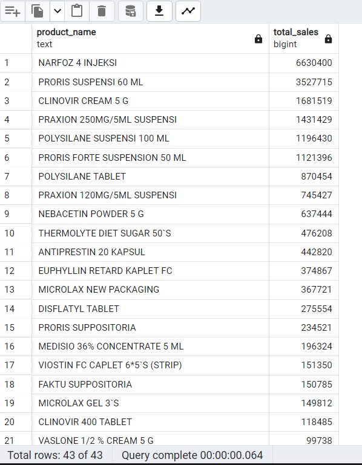
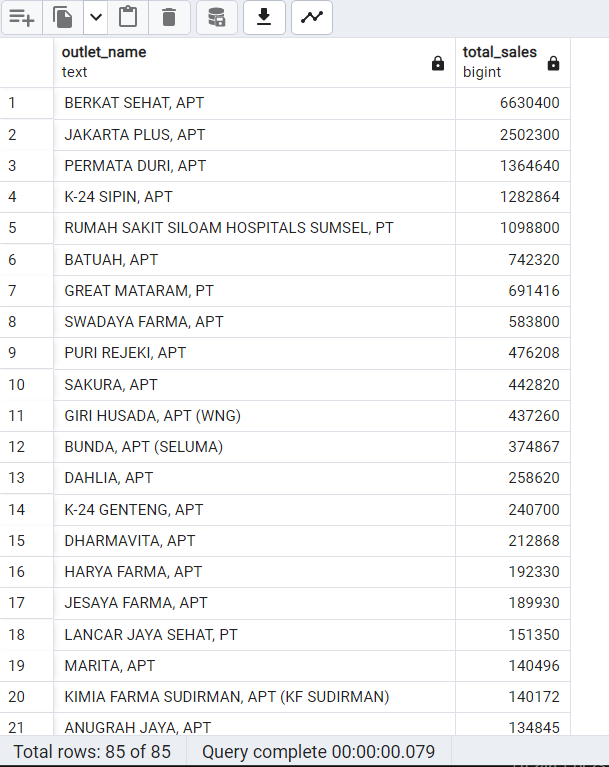
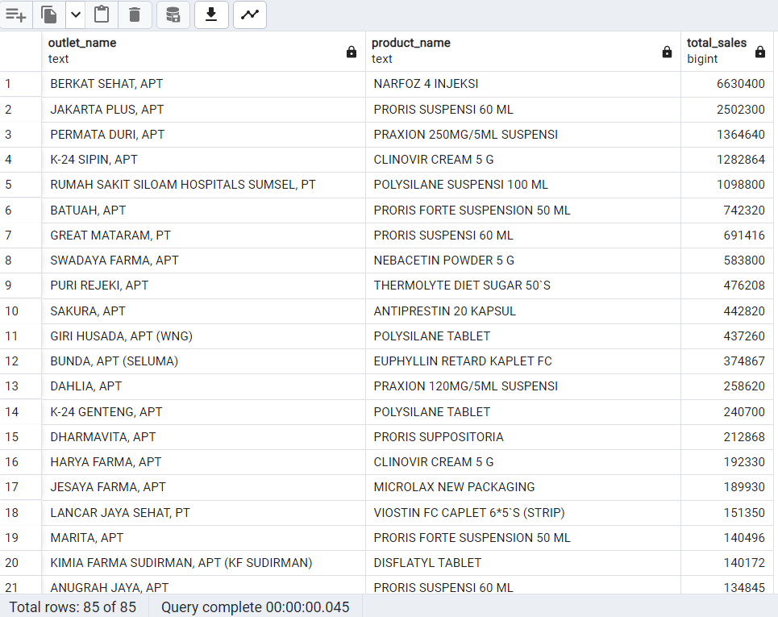
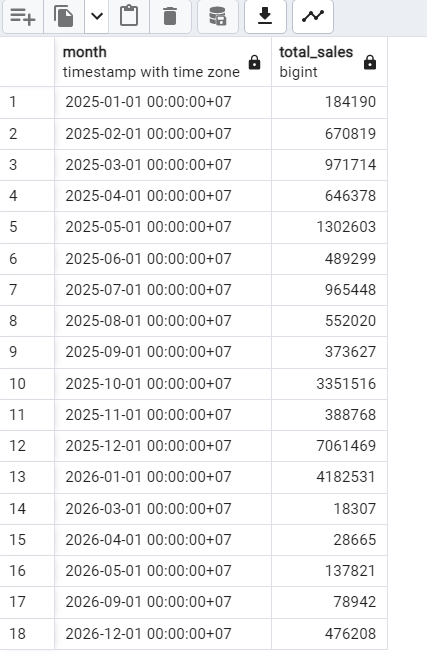

# Pharos Data Engineer Technical Test

## Overview

This project implements a simple **ETL (Extract, Transform, Load) data pipeline** to process sales data from an Excel dataset and load it into a PostgreSQL database. The pipeline performs data ingestion, cleaning, transformation, and database loading to ensure the data is ready for analytical queries.

The project is structured to demonstrate basic **data engineering practices**, including data quality handling, modular pipeline design, and SQL-based analytics.

# Technologies Used

- Python 3
- Pandas
- PostgreSQL
- SQL
- psycopg2

Optional tools used:

- pgAdmin
- Google Sheets (for optional analytics output)

# Project Structure

```
pharos-data-engineer-test
│
├── data
│   └── DATASET Technical Test Data Engineer.xlsx
├── src
│   ├── extract.py
│   ├── transform.py
│   └── load.py
├── sql
│   ├── schema.sql
│   └── analysis.sql
├── docs
│   ├── query_monthly_sales.png
│   ├── query_sales_per_month.png
│   ├── query_sales_per_outlet.png
│   └── query_top_product.png
├── main.py
├── requirements.txt
└── README.md
```

# Dataset

The dataset is provided as an **Excel file** containing sales data with the following columns:

- sales_period
- outlet_code
- outlet_name
- product_code
- product_name
- qty
- product_price
- actual_sales

The goal of the pipeline is to **clean and prepare this dataset** before loading it into PostgreSQL.

# ETL Pipeline

## 1. Extract

The extract step reads the Excel dataset using Pandas.

File:

src/extract.py

Function:

- Load Excel file
- Return DataFrame

## 2. Transform

The transform step cleans and prepares the data before loading.

File:

src/transform.py

Transformations performed:

- Convert `sales_period` into proper datetime format
- Convert `product_code` into string format
- Handle missing values
- Remove rows with incomplete data

Rows with missing values are removed to maintain data quality.

## 3. Load

The cleaned data is inserted into PostgreSQL.

File:

src/load.py

Load process:

- Connect to PostgreSQL database
- Insert cleaned records into the `sales` table
- Commit transactions

# Database Schema

The database table is created using:

sql/schema.sql

Table structure:

sales
```
| Column | Type |
| id | SERIAL PRIMARY KEY |
| sales_period | DATE |
| outlet_code | VARCHAR |
| outlet_name | TEXT |
| product_code | VARCHAR |
| product_name | TEXT |
| qty | INTEGER |
| product_price | INTEGER |
| actual_sales | INTEGER |
```
# SQL Analysis

Analytical queries are stored in:

sql/analysis.sql

Queries included:

### View All Data

SELECT \* FROM sales;

### Total Sales per Outlet

SELECT outlet_name,
SUM(actual_sales) AS total_sales
FROM sales
GROUP BY outlet_name
ORDER BY total_sales DESC;

### Product Performance per Outlet

SELECT outlet_name,
product_name,
SUM(actual_sales) AS total_sales
FROM sales
GROUP BY outlet_name, product_name
ORDER BY total_sales DESC;

### Total Sales per Product

SELECT product_name,
SUM(actual_sales) AS total_sales
FROM sales
GROUP BY product_name
ORDER BY total_sales DESC;

### Monthly Sales Trend

SELECT DATE_TRUNC('month', sales_period) AS month,
SUM(actual_sales) AS total_sales
FROM sales
GROUP BY month
ORDER BY month;

# Assumptions During Data Cleaning

Some assumptions were made during the transformation stage:

- Rows with missing values were removed to maintain data consistency.
- `product_code` values were converted to string to prevent numeric formatting issues.
- `sales_period` was converted into datetime format to allow time-based analysis.

# Handling Data Issues

The following data issues were identified:

### Missing Values

Some rows contained missing values in several columns. These rows were removed during transformation.

### Data Type Issues

Some columns were interpreted incorrectly by Excel. For example:

- `product_code` was converted to string format.

# How to Run the Project

## 1 Install Dependencies

pip install -r requirements.txt

## 2 Create Database

Create a PostgreSQL database:

pharos_sales

Run the schema:

sql/schema.sql

## 3 Run ETL Pipeline

Execute the pipeline:

python main.py

This will:

1. Extract data from Excel
2. Transform and clean the dataset
3. Load the data into PostgreSQL

## 4 Run Analytical Queries

Open PostgreSQL Query Tool and run:

sql/analysis.sql

# Bonus Implementation

### Analytics Spreadsheet

Monthly sales per outlet was generated and exported to a Google Spreadsheet.

This spreadsheet contains the following format:

Period | Outlet Code | Outlet Name | Sales

The spreadsheet is shared in **read-only mode** and can be accessed here:

Google Sheets Link:
https://docs.google.com/spreadsheets/d/1aeEsH3g43CrtQ-r3Cfd88N6V8SYMBDzSdGI-H_qwtws/edit?usp=sharing

This spreadsheet shows aggregated sales data per outlet per month, making it easier to analyze outlet performance and monthly trends outside the database.

## Screenshots / Results

Below are several analytical queries executed on the cleaned sales dataset.

### Top Selling Products


---

### Sales per Outlet


---

### Sales per Month


---

### Monthly Sales Trend


---

# Conclusion

This project demonstrates a simple but complete **data engineering workflow**:

- Data ingestion
- Data cleaning
- ETL pipeline design
- Database loading
- SQL analytics

The solution ensures that the dataset is properly cleaned and structured so that it can be queried efficiently for analytical insights.
